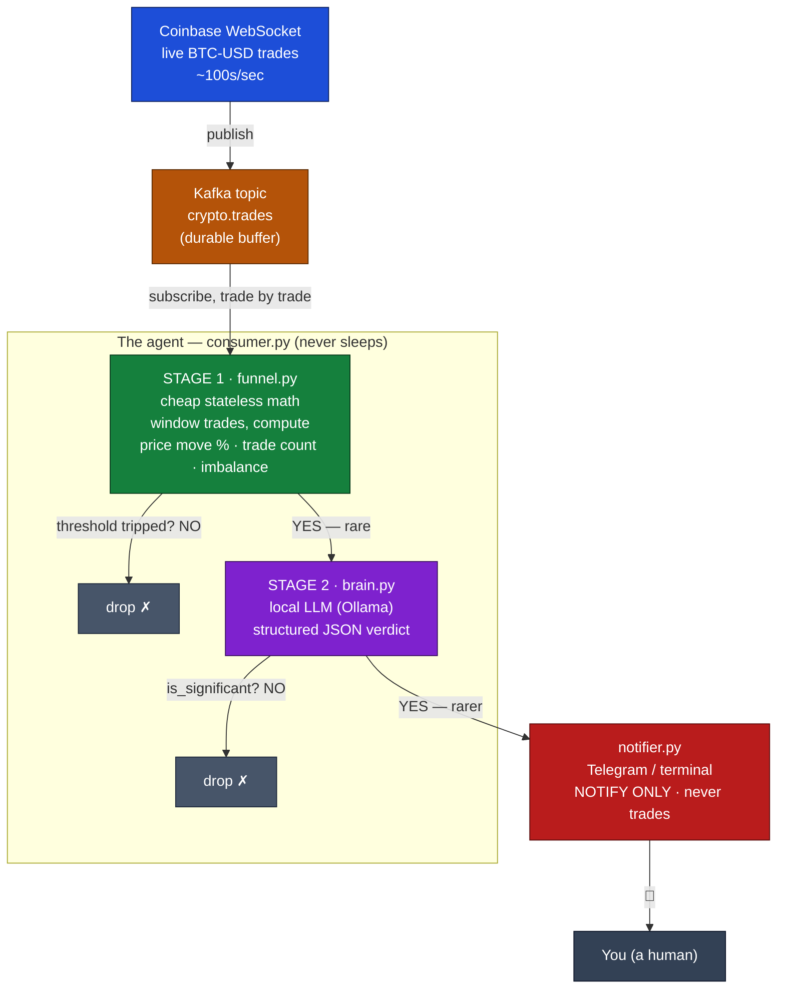

# Ambient Agent (crypto-market watcher)

An **ambient agent** doesn't wait for you to ask it something. It lives on a
stream of events, reasons about them continuously, and decides *on its own* when
something is worth interrupting you for.

This one watches the live Coinbase trade feed and tells you when the market does
something unusual. It is **read-only** — it watches, reasons, and notifies. It
**never places a trade** (the lowest human-in-the-loop trust level: *notify*).

## Architecture



If your previewer doesn't render Mermaid, here's the same flow as plain text:

```
Coinbase WS  ──publish──►  Kafka topic (crypto.trades)  ──subscribe──►  consumer.py
 producer.py                  durable buffer                              the agent
                                                                              │
                              ┌───────────────────────────────────────────────┘
                              ▼
                    STAGE 1 · funnel.py  — cheap math on each time window
                    (price move %, trade count, buy/sell imbalance)
                              │
                    threshold tripped?  ──No──►  drop ✗
                              │ Yes (rare)
                              ▼
                    STAGE 2 · brain.py  — local LLM (Ollama), JSON verdict
                              │
                    is_significant?  ──No──►  drop ✗
                              │ Yes (rarer)
                              ▼
                    notifier.py  ── 🔔 Telegram / terminal ──►  You
                    NOTIFY ONLY — never trades
```

The **two-stage funnel** is the key idea. The stream emits hundreds of trades a
second; the LLM is expensive. So Stage 1 buckets trades into time windows and
runs trivial math (price move %, trade count, buy/sell imbalance). Most windows
are discarded for free. Only windows that trip a threshold reach Stage 2, where
a local Ollama model judges whether to actually notify you. The funnel narrows
hard at every step: **hundreds of trades/sec → a few windows → rarely an LLM
call → almost never a notification.**

## Components

| File              | Role                                                        |
|-------------------|-------------------------------------------------------------|
| `src/producer.py` | Senses — Coinbase WebSocket → Kafka                         |
| `src/funnel.py`   | Stage 1 — windowing + cheap stateless math (the filter)     |
| `src/brain.py`    | Stage 2 — local LLM (Ollama) with structured JSON verdict   |
| `src/notifier.py` | Escalation path — terminal or Telegram                      |
| `src/consumer.py` | The agent loop — wires the funnel together                  |
| `src/config.py`   | All config via `.env`                                       |

## Prerequisites

- Python 3.9+
- Docker (for Kafka)
- [Ollama](https://ollama.com) running locally

## Setup

```bash
# 1. Python deps (a venv is recommended)
python3 -m venv .venv && source .venv/bin/activate
pip install -r requirements.txt

# 2. Config
cp .env.example .env        # tweak thresholds / model if you like

# 3. The brain — pull a small local model
ollama pull llama3.2

# 4. The nervous system — start Kafka
docker compose up -d
```

## Run

Two processes. In separate terminals (with the venv active):

```bash
# Terminal 1 — the senses (Coinbase -> Kafka)
python -m src.producer

# Terminal 2 — the agent (Kafka -> funnel -> brain -> notify)
python -m src.consumer
```

The producer logs every 100 trades. The agent logs whenever Stage 1 trips and
prints a 🔔 notification whenever the brain judges a window significant. Pick a
busier pair (e.g. `PRODUCT_ID=BTC-USD`) and loosen the thresholds in `.env` if
you want to see notifications quickly.

## Offline smoke test

No Kafka, no network, no Ollama required — exercises the funnel math and wiring:

```bash
python -m tests.smoke
```

## Tuning the funnel (`.env`)

| Var                        | Meaning                                            |
|----------------------------|----------------------------------------------------|
| `WINDOW_SECONDS`           | Size of each time bucket                            |
| `MIN_TRADES`               | Skip thin windows below this trade count            |
| `PRICE_MOVE_PCT_THRESHOLD` | Abs % move within a window that trips Stage 1       |
| `IMBALANCE_THRESHOLD`      | Abs buy/sell volume imbalance (0..1) that trips it  |
| `OLLAMA_MODEL`             | Local model for Stage 2                             |

## Make it general

Coinbase is just the example `stream`. Every ambient agent shares the same
skeleton — *a stream, a filter, a reasoner, and an escalation path to a human*.
Swap `producer.py` to point at email, logs, RSS, etc.; Stage 1's metrics and the
brain's prompt; and the rest of the pipeline is unchanged.
